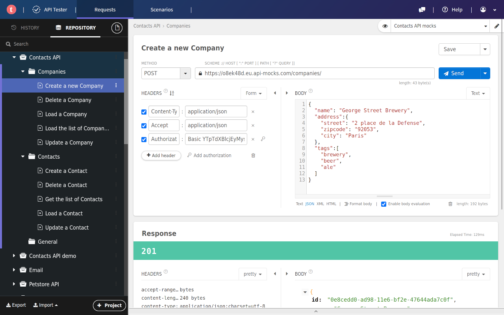

# ChromePlugin
chrome插件集合，自己开发或者收集一些比较好用的插件，我能收集到代码的我会直接给大家放到这个仓库里并给出导航，大家可以直接clone使用，一些插件在Chrome商店里，我也会给出链接

# 插件开发教程
[【干货】Chrome插件(扩展)开发全攻略](https://blog.haoji.me/chrome-plugin-develop.html?from=xa)

# 插件集合
1. [一键切换浏览器夜间模式](https://github.com/Elaine2048/ChromePlugin/tree/main/dark-mode-extension)【自己开发】
2. [去除百度搜索广告](https://github.com/Elaine2048/ChromePlugin/tree/main/remove-adv)【自己开发】
3. [Talend API Tester - Free Edition](https://chromewebstore.google.com/detail/talend-api-tester-free-ed/aejoelaoggembcahagimdiliamlcdmfm)
   功能：模拟网络请求，类似postman，但是我觉得比postman好用，而且不用额外再下一个软件了
   
   

#### 如果大家有什么想要的插件，也可以在这里许愿哦，我会帮大家去寻找或者直接开发

